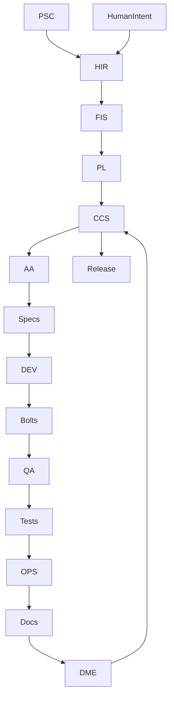

# AI-DLC Output Formats

## Purpose
This document provides reusable output examples for AI-DLC documentation generation.

DOC must treat these examples as templates and reference material. Generated summaries should use one canonical PDF-style Markdown file per request unless Human explicitly asks for another format. Do not generate duplicate same-content summaries in multiple formats.

## Canonical Generated Summary Rule
- Preferred generated output: PDF-style Markdown under `ai_dlc/docs/summary/`.
- Filename convention: `YYYY_MM_DD_<topic>_summary.md`.
- Tables, Mermaid diagrams, or ASCII maps may be embedded only when they add distinct information.
- README-style, Mermaid-only, and ASCII-only examples are reference formats, not required duplicate outputs.

## Example Table 1 - Request Review

| Behavior | Request | Frozen Prompt | PL | Status | Consistency Check |
|----------|---------|---------------|----|--------|-------------------|
| Documentation generation | Create governed AI-DLC summary examples | DOC prompt | PL | Approved | No duplicate same-content formats |

## Example Table 2 - Role Responsibilities

| Role | Purpose | Inputs | Outputs |
|------|---------|--------|---------|
| HIR | Validate Human Intent | PSC, Human Intent | FIS Draft |
| PL | Approve FIS | FIS Draft | Approved FIS |
| AA | Generate Specs | Approved FIS | Feature Specs |
| DEV | Implement Bolts | Specs | Code + Bolts |
| QA | Validate | Bolts | Tests |
| OPS | Runtime Safety | Tests | OPS Report |
| DOC | Documentation | FIS, Specs, OPS | Docs |
| DME | Traceability | All artifacts | Traceability Matrices |
| CCS | Governance | All artifacts | Merge Approval |

## Example Table 3 - Artifact Ownership

| Artifact | Owner | Editable by Human? | Editable by AI? |
|----------|-------|--------------------|-----------------|
| PSC | Human | ✔ | ✖ |
| Human Intent | Human | ✔ | ✖ |
| Defect Reports | Human | ✔ | ✖ |
| Change Requests | Human | ✔ | ✖ |
| FIS | AI | ✖ | ✔ |
| Specs | AA | ✖ | ✔ |
| Bolts | DEV | ✖ | ✔ |
| Tests | QA | ✖ | ✔ |
| Docs | DOC | ✖ | ✔ |
| Traceability | DME | ✖ | ✔ |

## Example Table 4 - File Access Matrix

| File/Folder | Human | AI | CCS |
|-------------|-------|----|-----|
| psc.md | ✔ | ✖ | ✔ |
| human_intent.md | ✔ | ✖ | ✔ |
| defects/ | ✔ | ✖ | ✔ |
| change_requests/ | ✔ | ✖ | ✔ |
| fis.md | ✖ | ✔ | ✔ |
| specs/ | ✖ | ✔ | ✔ |
| bolts/ | ✖ | ✔ | ✔ |
| tests/ | ✖ | ✔ | ✔ |
| docs/ | ✖ | ✔ | ✔ |
| traceability/ | ✖ | ✔ | ✔ |

## Example Table 5 - Governance Rules

| Category | Rule |
|----------|------|
| Domain | Only Indian stock analysis |
| Forbidden | No trading, no portfolio management |
| Compliance | No financial advice |
| Architecture | Must use orchestrator |
| Governance | No bypass of CCS |
| Drift | No unauthorized edits |

## Example Table 6 - Installation Checklist

| Step | Description |
|------|-------------|
| 1 | Create ai_dlc/ folder |
| 2 | Add PSC |
| 3 | Add Human Intent |
| 4 | Add Manifest |
| 5 | Add Prompts |
| 6 | Add Folder Structure |
| 7 | Add Migration Blueprint |
| 8 | Run AISA Migration |
| 9 | Start pipeline: `HIR, process Human Intent.` |

# Output Format Templates

## Mermaid Diagram Example
Use this only when a visual workflow adds distinct value to the canonical PDF-style summary.



## PDF-Style Markdown Example
Use this as the default generated summary style.

```markdown
# AI-DLC Summary

## Document Metadata
| Field | Value |
|-------|-------|
| Project | AI Stock Agent |
| Domain | Indian Stock Analysis |
| Output Type | PDF-style Markdown Summary |
| Destination | ai_dlc/docs/summary/ |

## Overview
AI-DLC is a governed, multi-role development lifecycle for controlled change delivery.

## Workflow
Human Intent -> HIR -> FIS -> PL -> CCS -> AA -> DEV -> QA -> OPS -> DOC -> DME -> CCS -> Release

## Governance Rules
- PSC defines domain boundaries.
- FIS is AI-owned.
- No trading, portfolio management, or financial advice.
- No bypass of CCS.
- Generate one canonical summary only; do not duplicate same-content outputs in multiple formats.

## Next Action
Proceed through the approved AI-DLC role sequence for the linked change request.
```

## README-Style Table Example
Reference only. Do not generate a separate README-style duplicate when the PDF-style summary already contains the same content.

```markdown
# AI-DLC Quick Reference

## Roles
| Role | Responsibility |
|------|----------------|
| HIR | Validate Human Intent |
| PL | Approve FIS |
| AA | Generate Specs |
| DEV | Implement Bolts |
| QA | Test Features |
| OPS | Runtime Validation |
| DOC | Documentation |
| DME | Traceability |
| CCS | Final Governance |
```

## Visual ASCII Architecture Map Example
Reference only. Embed inside the canonical summary only when it adds distinct value.

```text
PSC -> Human Intent -> HIR -> FIS -> PL -> CCS -> AA -> Specs -> DEV -> Bolts -> QA -> Tests -> OPS -> Docs -> DME -> CCS -> Release
```

# DOC Generation Command

Use this command after the governed workflow authorizes DOC summary generation:

```text
DOC, generate the requested AI-DLC summary using the examples in ai_dlc/docs/examples/.
Store the output in ai_dlc/docs/summary/ as one canonical PDF-style Markdown file.
Do not generate duplicate same-content summaries in multiple formats.
```
