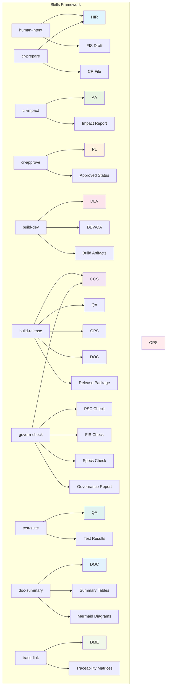
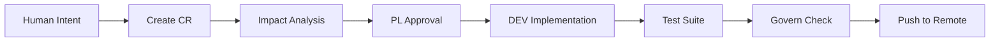

# AI-DLC Skill Flow Diagram

## Skill → Role → Output Relationship



## Skill Execution Patterns

### Feature Development Flow


### Build Profiles Flow
```mermaid
flowchart LR
    BUILD_DEV[build-dev] --> TEST[test-suite]
    TEST --> TRACE[trace-link]
    
    GOVERN[govern-check] --> BUILD_RELEASE[build-release]
    BUILD_RELEASE --> PUSH[git push]